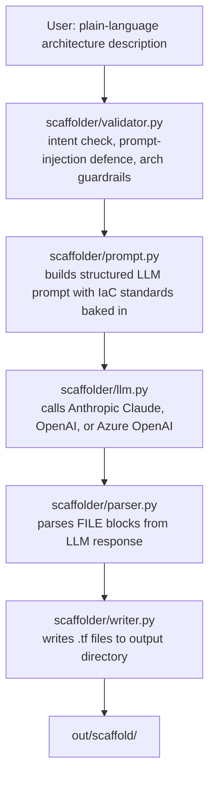

# tf-scaffold-ai

A GitHub Actions composite action (and CLI tool) that takes a **plain-language description** of a desired cloud architecture and generates a working **Terraform scaffold** — structured into modules, with variables, outputs, and least-privilege defaults baked in.

Supports **Anthropic Claude** (default, recommended), **OpenAI**, and **Azure OpenAI** — configure by passing the appropriate API key.

Built as the third project in a portfolio demonstrating AI-augmented infrastructure tooling. See also:
- [multicloud-sa-toolkit](https://github.com/JamesIOmete/multicloud-sa-toolkit) — the multi-cloud Terraform toolkit this scaffold tool targets
- [tf-plan-ai-reviewer](https://github.com/JamesIOmete/tf-plan-ai-reviewer) — AI review of Terraform plan output
- [multicloud-estate-briefing](https://github.com/JamesIOmete/multicloud-estate-briefing) — LLM-powered "state of the estate" briefing

---

## How it works



```
out/scaffold/
  ├── versions.tf
  ├── variables.tf
  ├── main.tf
  └── outputs.tf
```

---

## What makes it different from the other two projects

The other two projects are **downstream analytical tools** — they operate on infrastructure artifacts that already exist (a plan JSON, an inventory JSON). This project is **generative and upstream**: it generates Terraform code from only a plain-language description.

The key engineering challenge is not just generation — it is **constrained generation**: the LLM must produce code that follows security and architectural best practices by default, even if the user's description doesn't ask for them.

---

## Input validation and guardrails

Before the LLM is called, two validation layers run on the user's description:

1. **Intent validation** — rejects off-topic, too-vague, or nonsensical inputs and asks the user to revise.
2. **Prompt-injection defense** — detects attempts to hijack the system prompt and blocks them with an informative error.

Architectural anti-patterns (wide-open CIDRs, wildcard IAM, disabled encryption) are surfaced as **warnings** rather than hard errors, and the system prompt instructs the LLM to apply safe defaults regardless.

---

## Quick start

### As a GitHub Actions step

```yaml
jobs:
  scaffold:
    runs-on: ubuntu-latest
    steps:
      - uses: actions/checkout@v4

      - name: Generate Terraform scaffold
        uses: JamesIOmete/tf-scaffold-ai@v1
        with:
          description: >
            A VPC with two private subnets and one public subnet across two AZs.
            A NAT gateway in the public subnet. An EC2 instance in a private subnet
            with an IAM role scoped to S3 read-only on a named bucket.
            All resources tagged for production.
          cloud: aws
          anthropic-api-key: ${{ secrets.ANTHROPIC_API_KEY }}
          github-token: ${{ secrets.GITHUB_TOKEN }}

      - name: Use scaffold
        run: |
          cd out/scaffold
          terraform init
          terraform validate
```

### As a CLI tool

```bash
cd tf-scaffold-ai
pip install -r requirements.txt

python -m scaffolder.scaffold \
  --description "A VPC with two private subnets and an EC2 instance" \
  --cloud aws \
  --output out/scaffold
```

### Dry-run (validate only, no LLM call)

```bash
python -m scaffolder.scaffold \
  --description "A VPC with two private subnets" \
  --cloud aws \
  --dry-run
```

---

## Provider examples

### Anthropic Claude (default, recommended)

```yaml
- uses: JamesIOmete/tf-scaffold-ai@v1
  with:
    description: "A VPC with two private subnets and an EC2 instance"
    cloud: aws
    anthropic-api-key: ${{ secrets.ANTHROPIC_API_KEY }}
    anthropic-model: claude-sonnet-4-6
    github-token: ${{ secrets.GITHUB_TOKEN }}
```

### OpenAI

```yaml
- uses: JamesIOmete/tf-scaffold-ai@v1
  with:
    description: "A VPC with two private subnets and an EC2 instance"
    cloud: aws
    openai-api-key: ${{ secrets.OPENAI_API_KEY }}
    model: gpt-4o
    github-token: ${{ secrets.GITHUB_TOKEN }}
```

### Azure OpenAI

```yaml
- uses: JamesIOmete/tf-scaffold-ai@v1
  with:
    description: "A VPC with two private subnets and an EC2 instance"
    cloud: aws
    azure-openai-endpoint: ${{ secrets.AZURE_OPENAI_ENDPOINT }}
    azure-openai-key: ${{ secrets.AZURE_OPENAI_KEY }}
    azure-openai-deployment: gpt-4o
    github-token: ${{ secrets.GITHUB_TOKEN }}
```

**Provider selection:** Anthropic is used if `anthropic-api-key` is set. Azure OpenAI is used if `azure-openai-endpoint` is set. Otherwise OpenAI is used. Only one provider key is required.

---

## Multi-cloud output

Pass `--cloud multi` (or `cloud: multi` in the action) to generate parallel scaffolds for AWS, Azure, and GCP. The output is structured as:

```
out/scaffold/
  aws/
    versions.tf
    variables.tf
    main.tf
    outputs.tf
  azure/
    ...
  gcp/
    ...
```

---

## Key AI concepts demonstrated

| Concept | Where |
|---------|-------|
| Structured LLM prompting with IaC domain constraints | `scaffolder/prompt.py` |
| Pre-LLM input validation and prompt-injection defense | `scaffolder/validator.py` |
| LLM response parsing (structured FILE blocks with fallback) | `scaffolder/parser.py` |
| Anthropic / OpenAI / Azure OpenAI multi-provider support | `scaffolder/llm.py` |
| AI-generated code written to disk as an artifact | `scaffolder/writer.py` |

---

## Running tests

```bash
pip install -r requirements.txt
pytest tests/ -v
```

---

## Related projects

- [multicloud-sa-toolkit](https://github.com/JamesIOmete/multicloud-sa-toolkit)** — the multi-cloud Terraform toolkit this scaffold targets; use UC01–UC05 patterns as the architectural baseline for generated scaffolds.
- [tf-plan-ai-reviewer](https://github.com/JamesIOmete/tf-plan-ai-reviewer)** — AI review of Terraform plan output; the natural downstream complement to this generator — scaffold here, review there.
- [multicloud-estate-briefing](https://github.com/JamesIOmete/multicloud-estate-briefing)** — LLM-powered estate briefing from inventory artifacts; completes the AI-augmented IaC lifecycle: generate → review → monitor.
- [iot-ops-agent](https://github.com/JamesIOmete/iot-ops-agent)** — autonomous AI agent for IoT fleet operations; demonstrates a more advanced agentic pattern beyond single-pass LLM generation.
- [aws-iot-edge-reference](https://github.com/JamesIOmete/aws-iot-edge-reference)** — end-to-end AWS IoT reference stack; example of the kind of architecture this scaffold tool can generate a starting point for.

